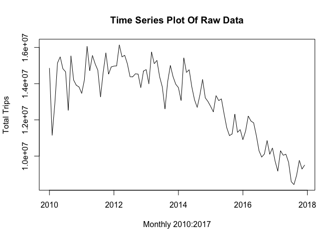
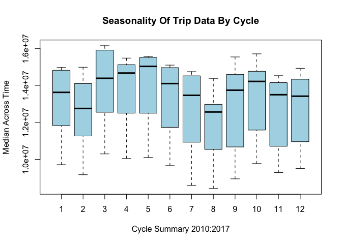
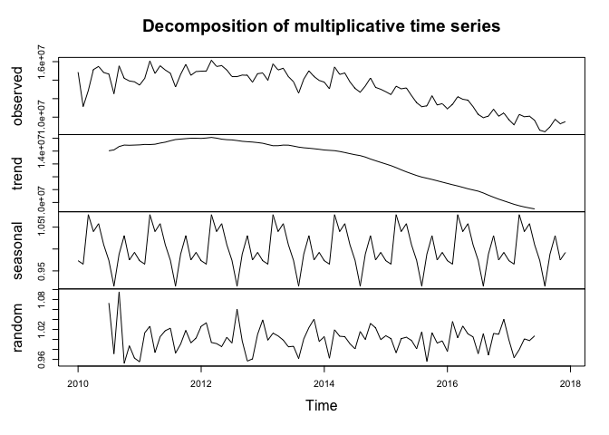
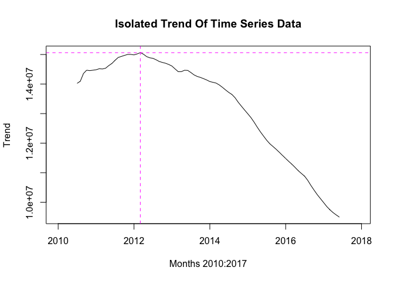
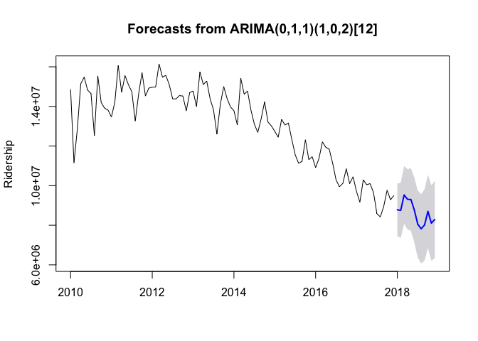
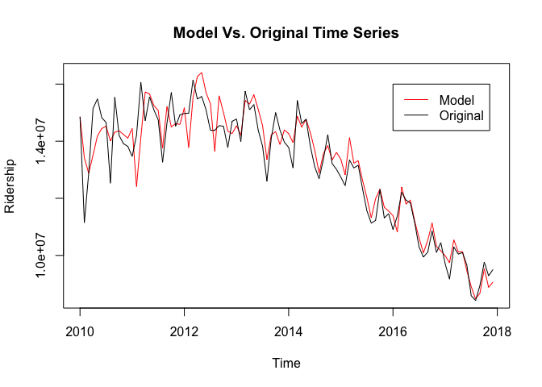
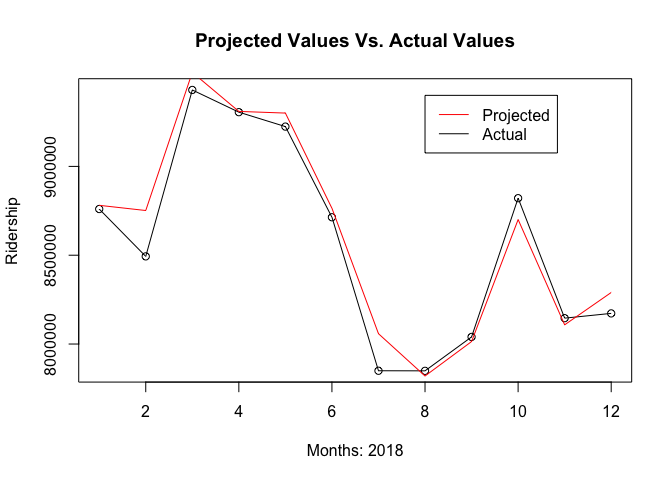
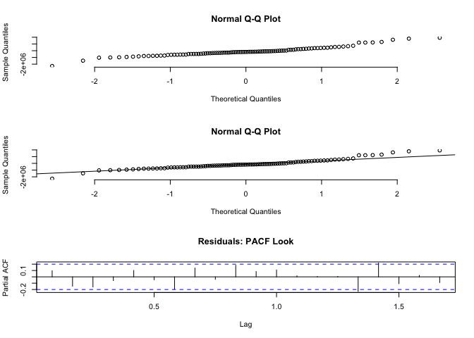
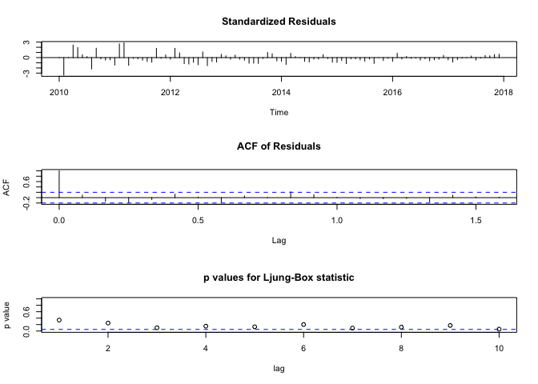
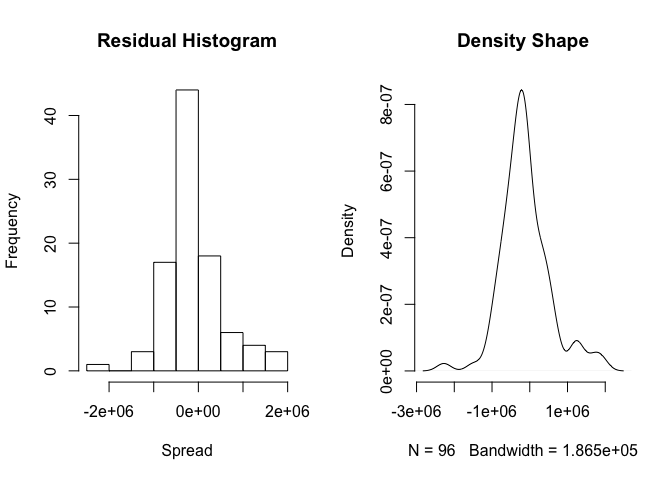

<center>

Time Series Analysis of Ridership

</center>
================
<center>

C. Perez

</center>

 

## Motivation

New York City (NYC) Taxi Medallions are physical tins verifying the
owner’s legal right to operate a taxicab within NYC. Due to the
restricted supply of these medallions, by consequence of legislation,
these tins were considered “ever increasing” assets in which the value
is directly correlated to the profitability of the taxicab itself, or at
least in theory it should be, and ridership is a key factor in
profitability. Seeing as financing a medallion eventually became
comparable to purchasing a home in NYC, it would make sense that
significant metrics such as ridership would be evaluated when
negotiating loan amounts. Furthermore, as ridership changes, it would
make sense that this metric would affect the borrower’s eligibility to
refinance as well.

Whether or not entities that back these loans take ridership into
account is completely up to the financing institution, however the
question still remains; **if ridership is considered a significant
metric, how can we succesfully predict what ridership would be in the
future given the data we have today?** Also, **How efficient is an ARIMA
model at forecasting ridership in this scenario?**

To answer these questions, I have decided to explore how effective TSA
would be in creating a model and using that model to predict future
values of ridership. It is typical when building a model to break up the
data into a training set, a tuning set, and a test set. For TSA, the
data can be split into two sets, a training set and a test set, as
tuning is generally handled when finding appropriate parameters for the
“best” model. Luckily, the capabilities of R limit the amount of
exploratory data analysis required when finding “good” parameters, and
therefore eases the necessity to tune as the best model is generated and
selected based on widely accepted criterion **(deeper dive to
follow)**.  
 

## Data

Monthly ridership data used for this analysis is publicly available and
can be found
[here](https://www1.nyc.gov/site/tlc/about/tlc-trip-record-data.page).  
 

## Methodology

1.  Download all individual monthly data files for 2010 through 2018 and
    read them into R.  
2.  Count the quantity of trips per month and save each count to a
    vector in chronological order.
3.  Export and save this vector to import for the Time Series Analysis.
4.  Conduct the Time Series Analysis
      - Exploratory Data Analysis (EDA)
      - Model Generating
      - Model Testing
      - Residuals EDA and Testing  

## Analysis

<center>

**Exploratory Data Analysis**

</center>

 

Importing the vector and creating a time series object yields the
following
structure:  
 

``` 
          Jan      Feb      Mar      Apr      May      Jun      Jul      Aug
2010 14863777 11145408 12884361 15144989 15481351 14825128 14656518 12528176
2011 13464996 14202799 16066350 14718972 15554868 15097861 14742561 13262441
2012 14969132 14983521 16146923 15477914 15567525 15096468 14379306 14381752
2013 14776615 13990176 15749228 15100468 15285049 14385456 13823840 12597109
2014 13782492 13063791 15428127 14618759 14774041 13813029 13106365 12688877
2015 12741017 12442388 13342951 13063760 13158079 12332380 11562783 11130304
2016 10906858 11382049 12210952 11934338 11836853 11135470 10294080  9942263
2017  9710124  9168825 10294628 10046188 10102124  9656993  8588486  8422197
          Sep      Oct      Nov      Dec
2010 15540208 14199606 13912309 13819321
2011 14626748 15707756 14525862 14925982
2012 14546854 14522315 13776030 14696583
2013 14107693 15004556 14388451 13971118
2014 13374016 14232487 13218216 13014161
2015 11225063 12315488 11312676 11460573
2016 10116018 10854626 10102128 10449408
2017  8945574  9768740  9284777  9508050
```

 

The plot below shows ridership data, aggregated monthly from January
2010 through December 2017, plotted as a time series object. Data for
2018 has been set aside as the test set for evaluting the model.
Traditionally, examining the ACF and PACF yields insight into the “best”
parameters (p, d, q, etc.) for an ARIMA model; however, the R
**auto.arima** function applies necessary techniques to achieve
stationarity, if necessary, prior to finding appropriate parameters for
the “best”
model.  
 


 

Although the function now makes it easier to identify a model,
traditional methods in decomposition are still necessary in order to
confirm trends identified within the exploratory data analysis phase.
For example, the boxplot below was generated by cycle (month) across the
eight years of data provided in the initial plot. When viewed by cycle,
there is clearly a seasonal trend present which dips in warmer months
and increases in cooler months or months that tend to have high
precipitation. This makes sense seeing as people are probably more
likely to walk to their destination or wait for public transportation in
good weather.
 


   
Some questions do arise from the initial plot and cycle boxplot; for
example:

1.  **Why is there a sharp increase in variance over the first few
    months and generally consistent thereafter?**
2.  **Why does ridership dip in February when it is still fairly cold?**
3.  **Does the initial variance, anomaly or not, warrant a
    multiplicative decomposition over an additive?**

In reviewing the data to answer some of these questions, the ridership
values in early 2010 do not seem to align with the general trend,
specifically for the months of February and March. However, in testing
replacement values that do align with the trend (**not recommended,
purely out of curiosity**), the boxplot still displays a dip between
cycles 1 and 3, indicating that the values are not outliers in that they
do not change the seasonal pattern for these cycles and in fact do not
change much about anything other than the visual variance on the initial
plot. **In order to maintain data integrity, the original values were
used** and a multiplicative decomposition was used as the gradual change
in variance hints at a multiplicative decomposition for the model. This
can be argued as the overall trend points more to an additive
decomposition, nontheless multiplicative was used for this analysis.

There are also other explanations and/or assumptions that might explain
dips and climbs such as February having less days than both surrounding
months January and March. Under the assumption that trips are
distributed evenly amongst days, and a difference of roughly 3 days,
this would explain at least 10% of the February dip as it relates to
neighboring months. Whatever the explanation may be, the important
takeaway is that the data has a seasonal component and hence the ARIMA
model generated should have a seasonal component as well.

The decomposition provided below shows a seasonal pattern consistent
with what was gleaned from the previous boxplot, and the decomposed
trend confirms the general decreasing trend seen in the initial time
series plot.  
 

 

The following plot explores the trend provided from the time series
decomposition. Lines of intersection have been added to mark the point
in time at which the trend begins consistently decreasing.
   

 

This point can be significant for many reasons. For example:

1.  This point could mark the start of a planned fair increase which one
    would naturally expect a decrease in ridership to follow.
2.  From a marketing perspective, this point could mark the entrance of
    a new competitor in the market, or  
3.  From a financing perspective, **if ridership is used in some way as
    a lending metric tied to profitability**, then this point could mark
    the beginning of higher interest rates (as loans take on more risk
    with anticipated decline in revenue) or less options to refinance
    (as the asset value could decrease if profitability is expected to
    decrease).

Nonetheless, any explanation or siginficance tied to this point would
have to be thoroughly researched and varies widely according to
perspective. For the purpose of this analysis (TSA and forecasting) it
marks the start of the more consistent trend which hints at a model with
a drift component. These hints are valuable in order to verify the
generated model makes sense on a fundamental level.  
     

<center>

**Model Generation**

</center>

 

The following result shows the ARIMA models generated along with the
criterion (AIC, AICc, and BIC) and identifies the best model among those
generated:  

``` 

 ARIMA(2,1,2)(1,0,1)[12] with drift         : Inf
 ARIMA(0,1,0)            with drift         : 2893.565
 ARIMA(1,1,0)(1,0,0)[12] with drift         : 2862.955
 ARIMA(0,1,1)(0,0,1)[12] with drift         : 2854.799
 ARIMA(0,1,0)                               : 2891.796
 ARIMA(0,1,1)            with drift         : 2875.393
 ARIMA(0,1,1)(1,0,1)[12] with drift         : Inf
 ARIMA(0,1,1)(0,0,2)[12] with drift         : 2851.704
 ARIMA(0,1,1)(1,0,2)[12] with drift         : 2839.968
 ARIMA(0,1,1)(2,0,2)[12] with drift         : 2841.094
 ARIMA(0,1,1)(2,0,1)[12] with drift         : Inf
 ARIMA(0,1,0)(1,0,2)[12] with drift         : 2861.97
 ARIMA(1,1,1)(1,0,2)[12] with drift         : Inf
 ARIMA(0,1,2)(1,0,2)[12] with drift         : 2840.653
 ARIMA(1,1,0)(1,0,2)[12] with drift         : Inf
 ARIMA(1,1,2)(1,0,2)[12] with drift         : 2842.736
 ARIMA(0,1,1)(1,0,2)[12]                    : 2837.98
 ARIMA(0,1,1)(0,0,2)[12]                    : 2851.137
 ARIMA(0,1,1)(1,0,1)[12]                    : Inf
 ARIMA(0,1,1)(2,0,2)[12]                    : 2838.947
 ARIMA(0,1,1)(0,0,1)[12]                    : 2854.787
 ARIMA(0,1,1)(2,0,1)[12]                    : Inf
 ARIMA(0,1,0)(1,0,2)[12]                    : Inf
 ARIMA(1,1,1)(1,0,2)[12]                    : 2839.245
 ARIMA(0,1,2)(1,0,2)[12]                    : 2838.776
 ARIMA(1,1,0)(1,0,2)[12]                    : Inf
 ARIMA(1,1,2)(1,0,2)[12]                    : 2840.788

 Best model: ARIMA(0,1,1)(1,0,2)[12]                    
```

    Series: tsdata 
    ARIMA(0,1,1)(1,0,2)[12] 
    
    Coefficients:
              ma1    sar1     sma1    sma2
          -0.6742  0.8821  -0.6575  0.2193
    s.e.   0.0831  0.0733   0.2214  0.2454
    
    sigma^2 estimated as 4.565e+11:  log likelihood=-1413.65
    AIC=2837.31   AICc=2837.98   BIC=2850.08

   

<center>

**Model Testing**

</center>

   
The following graphs show the predictions (forecasts) for the year 2018,
and the model as it compares to the original time series, respectively.
It is important to note that as time increases the fit and accuracy
increases which is important for this analysis specifically as the
concern here is accuracy in predicting future values. Should the time
series plot hint at cycles (crudely, repeated values across larger gaps
in time) then it might be best to secure a better fit for earlier values
of the time series object.
 


 

The plot below shows a visual comparison for the predictions, and based
on the visual inspection, the forecasted values are fairly accurate. The
black line shows the original time series for 2018 (**test set**) while
the red line shows the predictions (**forecasts**) for the same
year.  
 


 

The following table provides different numerical measures of accuracy,
the most significant being the **Mean Absolute Percentage Error
(MAPE)**, which measures the average positive differences between the
forecast and the test set. As we can see below, the MAPE is incredibly
small and confirms what was suspected visually, that this is in fact a
good prediction.  
   

``` 
                     ME     RMSE       MAE        MPE     MAPE      MASE
Training set -110223.10 657843.7 491341.53 -1.0090481 3.704051 0.6697912
Test set      -51848.15 115511.1  87386.04 -0.6129872 1.033338 0.1191237
                   ACF1
Training set 0.09573636
Test set             NA
```

<center>

**Residuals EDA & Testing**

</center>

 

The real confirmation on the quality of the model comes from tesing the
residuals. A fundamental idea behind TSA is that we have a time series
object with one component, that being random variation or “white noise”,
that we cannot predict or replicate in our models. This component serves
as irreducible error from a statistical learning perspective, as such
the residuals (differences between the model and original series) should
essentially be white noise if the model is “good”. Basically, if all
components present were accounted for, testing the residuals should
produce the same diagnositcs as testing white noise. The following
results show the output of the residuals testing and the conclusion
wraps up the results of the
tests.


 

## Conclusion

The Ljung\_Box statistic p-values are above the alpha threshold
indicating a failure to reject the null hypothesis that these residuals
are independently distributed, essentially exhibiting no correlation.
The density curve and histogram demonstrate the distribution of the
residuals are roughly normal. The ACF maintains markers within the
confidence region and the QQ plot of residuals vs. white noise confirms
the notion they are of the same distribution as the scatter plot markers
fall along the straight line. All of these results confirm the residuals
are essentially white noise and the model is a good fit.

Because the model is very accurate (produced good predictions for 2018
ridership), and the residulas testing confirmed them to be white noise,
it appears that TSA is a good approach for predicting NYC Taxi ridership
in this scenario. Like with any forecasting method, the effectiveness
can change given the conditions or circumstances occuring at that point
in time. For example, had this analysis tried to predict ridership for
2013 (decreased from 2012) using data between 2009 and 2012 (increasing
trend), I am confident the MAPE would be significantly higher and the
forecasts would vary significantly from the test set.    
 

#### Disclosure

This analysis makes no assertions as to the quality or permissable use
of this data, and does not serve as any form of advice or procedure
regarding lending. This analysis is purely a personal undertaking
intended to gauge the forecasting effectiveness of an ARIMA model on
data not typically analyzed as a time series object.
